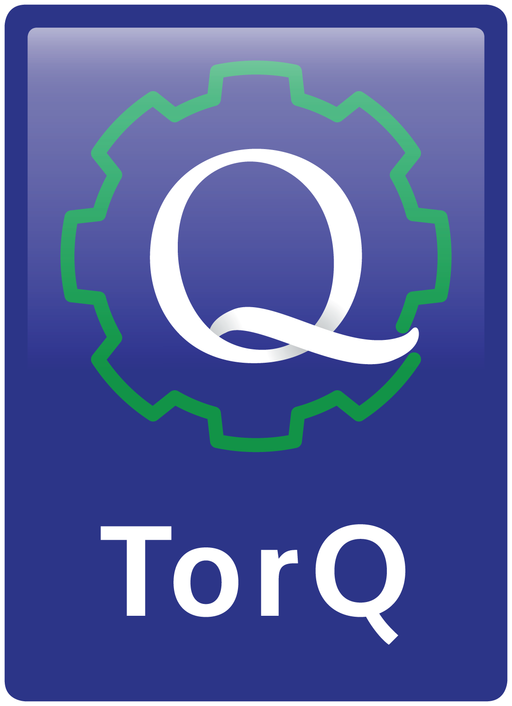

<!---->

# TorQ 中文文档 <!--<small>4.11.12</small>-->

> A high availability framework based on kdb+q.

- created by [AquaQ Analytics](http://www.aquaq.co.uk/)
- translated by [windsing](http://me.windsing.cn)

[Home Page](https://aquaqanalytics.github.io/TorQ/)
[Getting Started](#fmq)